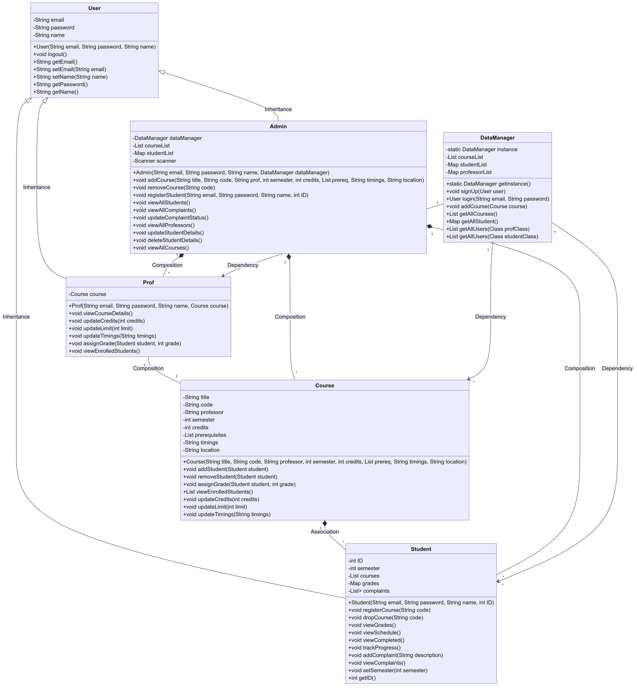

# University Course Management System

## Overview

The University Course Management System is a comprehensive application designed to manage various aspects of a university's academic environment. It caters to different types of users including students, professors, and administrators. The system facilitates user registration, course management, grade assignment, and complaint handling.

### Key Components

- **User Management**: This includes functionality for user registration and authentication. Different user types such as students, professors, and admins have specific roles and permissions.
- **Course Management**: Admins can add or remove courses, and professors can manage details related to the courses they are assigned to.
- **Enrollment**: Students can enroll in or drop courses. The system tracks the enrolled students and their course details.
- **Grade Management**: Professors have the ability to assign grades to students based on their performance in the courses.
- **Complaint Management**: Students can file complaints, and admins can view and update the status of these complaints.

## Assumptions

1. **Location Change**: Only administrators have the authority to change the location of a course.
2. **Course Addition**: When adding a new course, the system does not check whether the assigned professor already exists in the system.
3. **Professor**: One professor gets only one course assigned
4. **Grade**: Grade taken as integer(1-10)
5. **Admin**: While adding course, admin assigns a professor

## Features

### User Management

- **Registration**: Users can sign up as students, professors, or admins. The system stores their details securely.
- **Login**: Users can log in to access their respective functionalities based on their role.

### Course Management

- **Add Course**: Admins can add new courses to the system. This includes setting the course title, code, professor, semester, credits, prerequisites, timings, and location.
- **Remove Course**: Admins can remove courses from the system based on the course code.
- **View Courses**: All users can view the available courses. Admins can also view the complete list of courses.

### Enrollment

- **Register for Course**: Students can enroll in courses by providing the course code.
- **Drop Course**: Students can drop courses they are no longer interested in.

### Grade Management

- **Assign Grades**: Professors can assign grades to students enrolled in their courses.

### Complaint Management

- **File Complaint**: Students can register complaints with a description.
- **View Complaints**: Admins can view all complaints filed by students.
- **Update Complaint Status**: Admins can update the status of complaints to reflect whether they are resolved.

## UML Diagram

The UML diagram below illustrates the relationships between various components of the system, including inheritance, composition, dependency, and association.

## OOP Concepts Used

In the development of this system, several Object-Oriented Programming (OOP) concepts have been employed to ensure a robust and maintainable design. Here’s how each concept is utilized:

### Classes and Interfaces

- Classes represent the core entities of the system. For example, `User`, `Student`, `Prof`, `Admin`, and `Course` are all classes that encapsulate the attributes and behaviors related to these entities.

### Inheritance

- **Inheritance** allows classes to inherit attributes and methods from other classes, promoting code reuse and hierarchical relationships. In this system:
    - `Student`, `Prof`, and `Admin` classes inherit from the `User` class, gaining common properties and methods such as `email`, `password`, and `login()`.
    - This enables a consistent interface for all user types while allowing specialized behavior for each user type.

### Polymorphism

- **Polymorphism** enables objects of different classes to be treated as objects of a common superclass. It allows methods to have different implementations based on the object’s type:
    - Methods like `viewAvailableCourses()` and `assignGrade()` exhibit polymorphism. The method implementation varies depending on whether it’s called on a `Student`, `Prof`, or `Admin` object.

### Encapsulation

- **Encapsulation** is the practice of hiding the internal state and requiring all interaction to be performed through an object’s methods. It ensures that an object’s state cannot be directly accessed or modified from outside:
    - Each class encapsulates its attributes and provides getter and setter methods to access or modify these attributes. For instance, the `Course` class uses private fields and public methods to manage course details securely.

### Abstraction

- **Abstraction** simplifies complex systems by modeling classes based on the essential properties and behaviors. It hides implementation details that are not relevant to the user:
    - Abstract classes like `User` provide a blueprint for different types of users, focusing on the common functionality while allowing derived classes to implement specific details.

## File Structure

- **`User.java`**: This is an abstract class defining common attributes and methods for all users in the system. It includes methods for getting and setting user details such as email, password, and name.

- **`Student.java`**: A subclass of `User` representing students. It includes functionality for managing course enrollments, grades, and complaints.

- **`Prof.java`**: A subclass of `User` representing professors. It provides methods for managing course assignments, setting grades, and viewing course details.

- **`Admin.java`**: A subclass of `User` representing administrators. It includes methods for managing courses, registering students, and handling complaints.

- **`Course.java`**: Represents a course with attributes such as title, code, professor, semester, credits, prerequisites, timings, and location. It also includes methods for managing enrolled students and course details.

- **`DataManager.java`**: A singleton class responsible for managing data related to users, courses, and authentication. It provides methods for signing up users, logging in, and managing course and user data.

- **`Main.java`**: The entry point of the application. It provides the user interface for logging in, signing up, and accessing different functionalities based on user roles.
